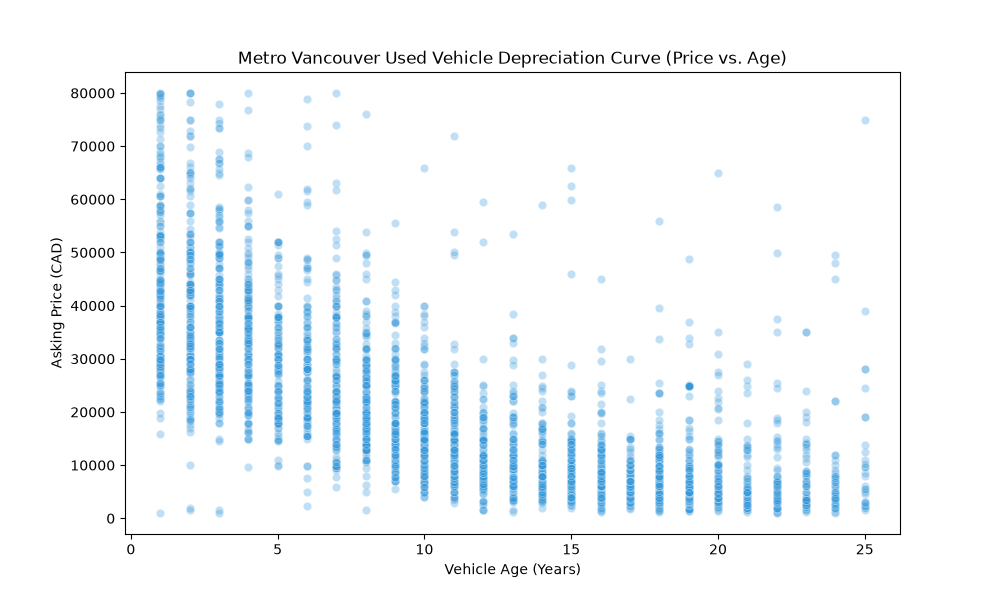
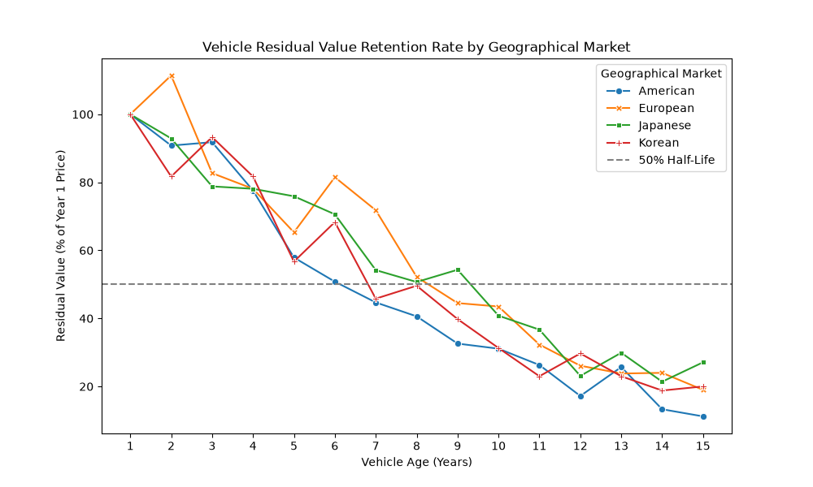
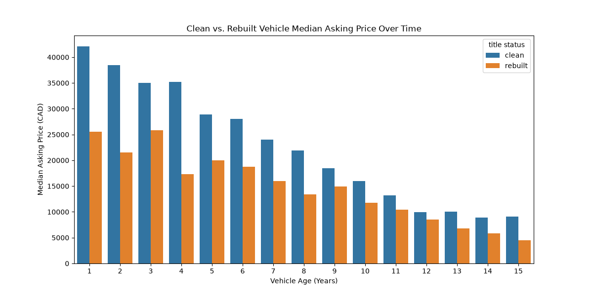
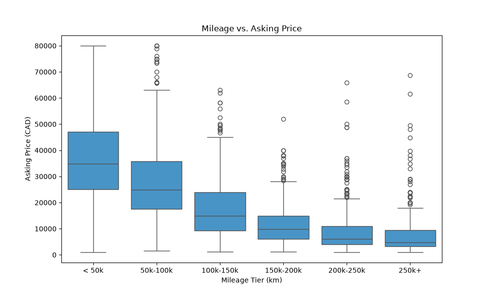
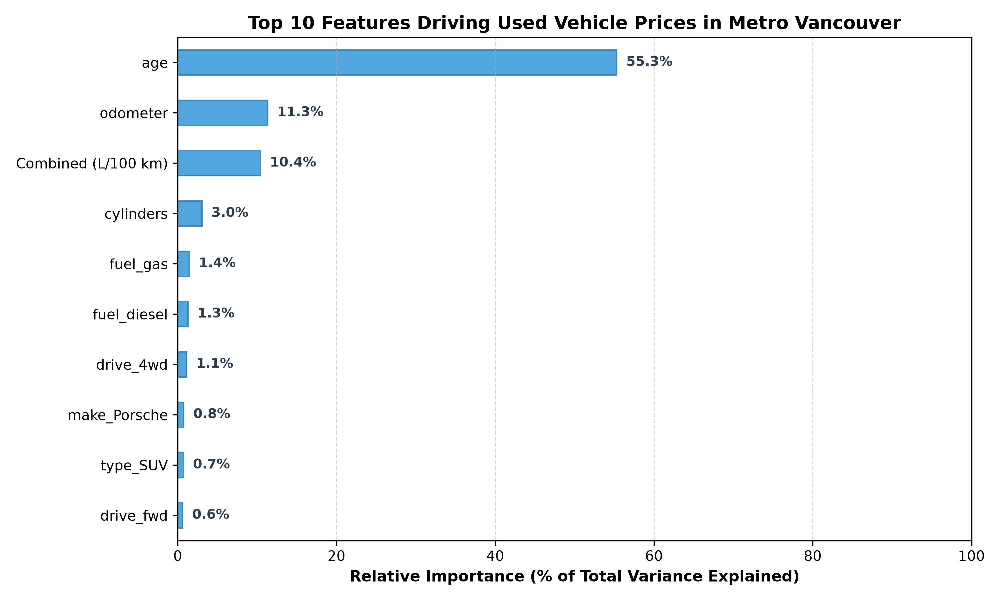

# Metro Vancouver Used Vehicle Market Analysis & Valuation Engine

An end-to-end data pipeline and machine learning engine analyzing 4,000+ Craigslist used vehicle listings across Metro Vancouver, integrated with 31 years (1995–2026) of Natural Resources Canada (NRC) Fuel Consumption Ratings to model local depreciation and flag mispriced listings.

---

## Why This Project?

Most vehicle valuation tools like the Kelley Blue Book or Canadian Black Book rely on broad national averages that do not consider the pricing differences among regional car markets. Metro Vancouver has several unique characteristics that heavily influence used car values:

1. **High Fuel Costs**: Metro Vancouver carries some of the highest fuel prices in North America ($1.85 to $2.20/L). Buyers actively price fuel efficiency into their purchase decisions.
2. **Rebuilt Titles**: British Columbia's auto insurer (ICBC) writes off repairable vehicles relatively early, leading to an active rebuilt title market on Craigslist that trades at sharp discounts compared to clean title equivalents.
3. **Import Concentration**: High local density of Japanese, Korean, and European imports creates distinct retention curves compared to domestic trucks and SUVs.

This project scrapes, cleans, and analyzes [Craigslist listings](https://www.craigslist.org/search/area/vancouver?cat=cta#search=2~gallery~0) across all Metro Vancouver sub-regions, links official [NRC fuel consumption figures](https://open.canada.ca/data/en/dataset/98f1a129-f628-4ce4-b24d-6f16bf24dd64), and trains machine learning models to predict fair market value and detect underpriced/overpriced listings.

---

## Key Market Insights

### 1. The 8-Year Depreciation Half-Life
Commuter vehicles in Metro Vancouver lose roughly 50% of their initial value by year 8, after which the curve flattens significantly into a $3,000–$8,000 "beater baseline."



### 2. Residual Value Retention by Market Origin
Japanese vehicles (Toyota, Honda, Subaru, Mazda) consistently hold the highest residual percentage over time. European luxury models (BMW, Mercedes-Benz, Audi) experience steep initial depreciation drops in years 3 to 7 due to higher expected maintenance and repair costs.



### 3. The Rebuilt Title Penalty
Rebuilt title vehicles trade at a median **25% to 35% discount** relative to clean title listings for late-model cars. However, as vehicles pass the 15-year mark, this discount narrows noticeably.



### 4. The High Mileage Price Dropoff
Vehicle prices drop sharply past the **100,000 km** and **160,000 km** (100,000 mile) thresholds. Listings clustered just below 100,000 km command a measurable pricing premium.



---

## What Actually Drives Used Car Prices?

Extracting feature importance from my trained Random Forest model reveals that three features account for **77.0%** of total pricing power in the local market:



* **Age (55.3%)**: The single dominant factor. Regardless of brand or trim, time is the universal price equalizer.
* **Odometer (11.3%)**: Causes wear and lowers mechanical lifespan due to heavy use from high mileages.
* **Combined Fuel Consumption (10.4%)**: Ranking #3 (ahead of cylinders, body type, and individual brands) confirms that integrating the NRC dataset added significant predictive signal. High fuel consumption often indicates high vehicle weight, larger engine size, and higher long-term operating cost in a high-gas-tax market.
* **Brand & Category Effects (~23% combined)**: While individual one-hot encoded categories appear small (ex. `make_Porsche` at 0.8%), brand reputation, body style, and drivetrain collectively account for the remaining variance.

---

## Pipeline Architecture

```
┌─────────────────────────┐     ┌────────────────────────────────┐
│     src/scraper.py      │     │    Natural Resources Canada    │
│  Craigslist Web Scraper │     │'95-'26 Fuel Consumption Ratings│
│   4,071 Raw Listings    │     │ 56 Brands, 4,504 Unique models │
└────────────┬────────────┘     └───────────────┬────────────────┘
             │                                  │
             └────────────────┬─────────────────┘
                              ▼
             ┌──────────────────────────────────┐
             │         src/clean_data.py        │
             │Data Cleaning, Merging and Filters│
             │  Matched 82.26% cars to FCR data │
             └────────────────┬─────────────────┘
                              ▼
             ┌──────────────────────────────────┐
             │          src/features.py         │
             │Calculate km/yr and usage category│
             │     Estimate annual fuel cost    │
             └────────────────┬─────────────────┘
                              ▼
             ┌──────────────────────────────────┐
             │           src/model.py           │
             │   80:20 train:test, 86 features  │
             │   Linear / RF / XGBoost Models   │
             └────────────────┬─────────────────┘
                              ▼
             ┌──────────────────────────────────┐
             │        predict_car_price()       │
             │   Instant valuation & deal check │
             └──────────────────────────────────┘
```

1. **`src/scraper.py`**: Queries Craigslist's JSON API search endpoints across Vancouver, Burnaby/New West, Delta/Surrey/Langley, North Shore, and Richmond. Extracts listing title, price, mileage, condition, title status, transmission, and other body attributes.
2. **`src/clean_data.py`**: Filters out dirty text, removes duplicates, filters scrap/parts/wanted listings, extracts make and model, and links each vehicle to its exact fuel consumption rating using a 5-case hierarchical matcher depending on how much information listing includes.
3. **`src/features.py`**: Calculates wear indicators including annual mileage (`km_per_year`), usage deviation relative to Canadian averages (`usage_ratio`), and estimated annual fuel expenditure (`annual_fuel_cost`).
4. **`src/eda_visualizations.py`**: Generates publication-ready Seaborn/Matplotlib figures documenting regional market dynamics including:
   * `01_depreciation_curve.png`: Metro Vancouver Used Vehicle Depreciation Curve (Price vs. Age) scatterplot
   * `02_residual_value.png`: Vehicle Residual Value Retention by Geographical Market line chart
   * `03_clean_vs_rebuilt.png`: Clean vs. Rebuilt Title Median Asking Price Over Time bar chart
   * `04_mileage_vs_price.png`: Mileage vs. Median Asking Price boxplot
5. **`src/model.py`**: Preprocessing pipeline including median imputation, standard scaling, and one-hot encoding across 86 features feeding into linear regression, random forest, and XGB Regressor models.

---

## Model Benchmark & Results

Models were evaluated on a filtered commuter dataset ($N = 3,174$, age $\le 25$, price between $\$1,000$ and $\$80,000$) with an 80/20 train/test split:

| Model | $R^2$ Score | Overall MAE | Median Error (Budget <$10k) | Median Error (Commuter $10k-$25k) |
| :--- | :---: | :---: | :---: | :---: |
| **Linear Regression (Baseline)** | 0.662 | $6,430.81 | $4,029.67 | $4,815.88 |
| **Random Forest Regressor** | **0.785** | **$4,314.70** | **$1,384.33** | **$2,483.91** |
| **XGBoost Regressor** | **0.792** | $4,409.36 | $1,473.63 | $2,760.48 |

### Performance Takeaways
* **Random Forest slashed overall MAE by $2,116** compared to the linear baseline, capturing non-linear depreciation curves and interaction effects between brand and body type.
* **Stratified Error Analysis**: On everyday commuter cars ($10k–$25k), Random Forest achieves a **median error of just $2,483** (~12% of transaction value). On budget cars under $10,000, median error drops to **$1,384**.
* Overall MAE is primarily pulled upward by rare high-variance listings (ex. heavily modified cars, trucks, salvage project cars, and collector vehicles).

---

## Interactive Valuation Tool

`src/model.py` includes a `predict_car_price()` function that transforms input specifications through the trained pipeline, predicts fair market value, and evaluates an optional asking price:

```python
from src.model import predict_car_price

# Example: Evaluating a 2018 Toyota RAV4 AWD listed on Craigslist for $21,000
predict_car_price(
    year=2018,
    make='Toyota',
    odometer=90000,
    car_type='SUV',
    cylinders=4,
    fuel_consumption=8.9,
    drive='4wd',
    asking_price=21000
)
```

**Output:**
```text
--- VEHICLE VALUATION REPORT ---
Vehicle: 2018 Toyota (90,000 km)
Estimated Fair Market Value: $24,581.12
Asking Price: $21,000.00
Price Verdict: [GREAT DEAL] - $3,581.12 below market value, 14.6% discount
```

---

## Project Structure

```text
vehicle-market-analysis/
├── data/
│   ├── raw/ # scraped Craigslist data, NRC FCR CSVs
│   └── processed/ # cleaned, merged, and filtered datasets
├── reports/
│   └── figures/
│       ├── 01_depreciation_curve.png
│       ├── 02_residual_value.png
│       ├── 03_clean_vs_rebuilt.png
│       ├── 04_mileage_vs_price.png
│       └── 05_feature_importance.png
├── src/
│   ├── scraper.py
│   ├── clean_data.py
│   ├── features.py
│   ├── eda_visualizations.py
│   └── model.py
├── requirements.txt
└── README.md
```

---

## Getting Started

### 1. Clone & Set Up Environment
```bash
git clone https://github.com/brandonlfw/vehicle-market-analysis.git
cd vehicle-market-analysis

python -m venv venv
# Windows:
venv\Scripts\activate
# Mac/Linux:
source venv/bin/activate

pip install -r requirements.txt
```

### 2. Run the Pipeline
```bash
# Generate all exploratory data visualizations
python src/eda_visualizations.py

# Train models, print tournament benchmarks, and run the valuation tool
python src/model.py
```

---

## Tech Stack
* **Language**: Python 3.14
* **Data Manipulation**: Pandas, NumPy
* **Machine Learning**: Scikit-Learn (`Pipeline`, `ColumnTransformer`, `RandomForestRegressor`), XGBoost
* **Data Visualization**: Matplotlib, Seaborn
* **Data Collection**: Requests, BeautifulSoup4
